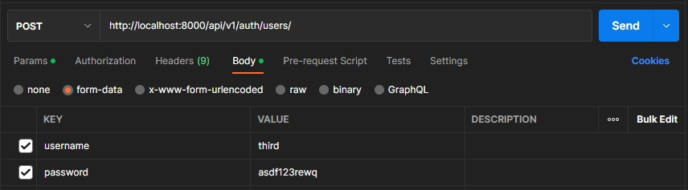
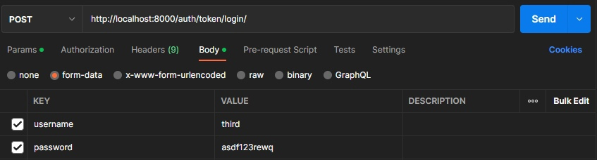
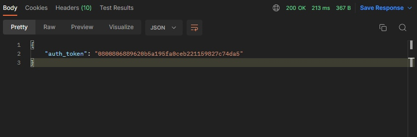
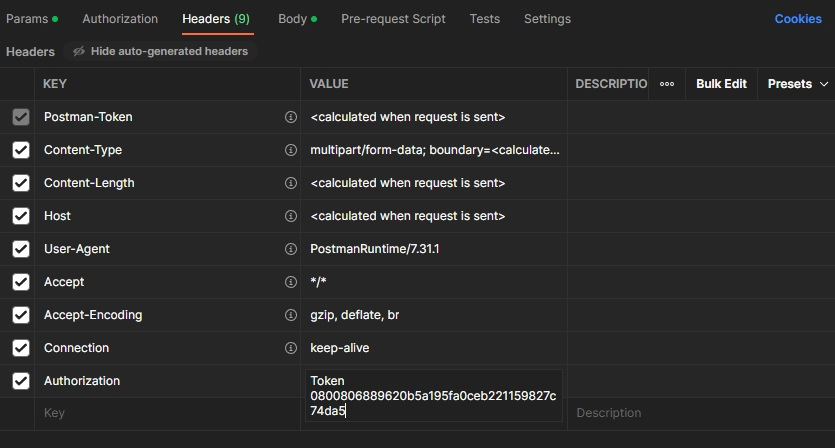

# Тестовое задание Python
## Быстрый старт
- Используйте `.env файл`. Вы можете скопировать `.env.example`
- Используйте `python3 -m venv ./.venv && source ./.venv/bin/activate && pip install -r requirements.txt` (необязательно, нужно только для того, если будет потребность в запуске без докера)
- Запустите команду `docker compose up -d --build`
- Выполните миграции `docker exec my_app python ./my_app/manage.py migrate`

## Запуск тестов
- Выполните команду `docker exec my_app python ./my_app/manage.py test api`   Тесты предназначены для тестирования всех API.

## Описание приложения

### Данный проект является сервисом, предоставляющим API для управления персональным списком задач. Необходима `авторизация`. Каждый пользователь видит только свои созданные задачи и может взаимодействовать только с ними. 

## Описание API
- `tasks/` - Получение списка задач. Метод `GET`.
- `tasks/create/` - Создание новой задачи. Метод `POST`.
- `tasks/<int:pk>/` - Получение конкретной задачи по id. Метод `GET`.
- `tasks/<int:pk>/mark-completed/` - Пометка задачи как выполненной. Метод `PATCH`.
- `tasks/delete/<int:pk>/` - Удаление задачи. Метод `DELETE`.

## Пример авторизации с помощью `Postman`
- Необходимо создать пользователя. Отправляем `POST` запрос на API `api/v1/auth/users/`, в `Body` указываем `username`, `password` и `email` (опционально).

- Далее после регистрации пользователя необходимо получить токен. Отправляем `POST` запрос на `auth/token/login/`, в `Body` указываем `username`, `password` и `email` (опционально), которые указывали при регистрации. На выходе получаем наш токен.

- Теперь, когда мы захотим обратиться к определенной API, мы должны в `headers` в поле `Authorization` указывать следующее: `Token <your token>`.

